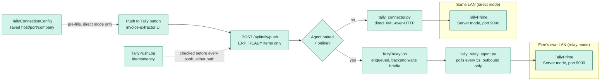
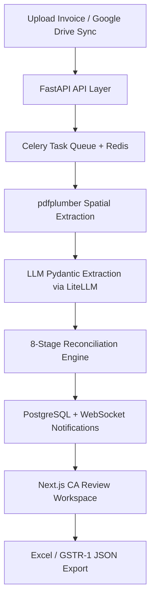
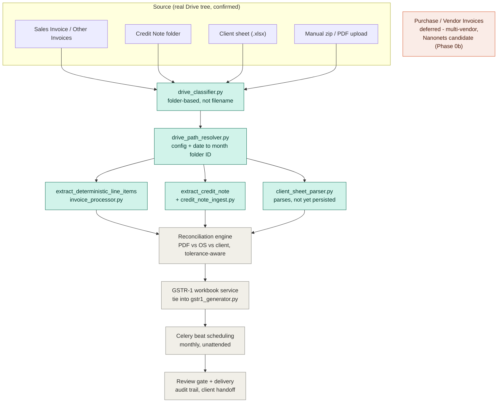

# AuditOS

**Enterprise CA-Level Invoice Auditor & Financial Reconciliation Platform**

AuditOS is a highly specialized, enterprise-grade AI pipeline designed to automate the extraction, mathematical reconciliation, and auditing of complex tax invoices (Sales & Purchase). Engineered to meet the rigorous standards of Chartered Accountants (CAs) and Big-4 audit firms, AuditOS bridges the gap between unstructured documents and strictly typed financial ledgers.

---

## Core Capabilities

### Extraction & Reconciliation
- **Layout-Preserving Extraction Engine:** Built on `pdfplumber` with coordinate-aware parsing (`layout=True`), providing the LLM with an accurate spatial representation of complex multi-page tables and mitigating text-scrambling from sequential OCR.
- **Granular Transaction Itemization:** Parses unstructured PDF tables while ignoring non-data headers, footers, and page breaks to capture individual billing transactions accurately.
- **Deterministic Math Reconciliation & Guardrails:** Validates and corrects LLM outputs against rigid accounting rules:
  - **Gross vs. Net Validation:** Resolves parsing anomalies where gross values are misidentified as net values by computing discount differentials.
  - **Anti-Double Counting:** Detects and filters out aggregate rows (Sub-Total, Grand Total) extracted as line items.
  - **Statutory Tax Apportionment:** Re-allocates aggregate tax amounts (IGST, CGST, SGST) to line-item level proportionally by taxable value.
- **Automated Ledger Balancing:** Flags discrepancies between itemized line sums and invoice totals, injecting an `Unallocated / Missing Lines` variance row to balance to the penny.
- **8-Stage Reconciliation Engine:** Post-extraction pipeline covering semantic classification, evidence scoring, HSN guardrails, tax math, dual-state reconciliation, variance classification, auto-correction proposals, and layout memory caching.

### GST Compliance
- **GSTR-2B Reconciliation:** Deterministic 8-stage engine matching purchase invoices against the GSTR-2B portal data, with ITC Section 17(5) eligibility rules and Excel export.
- **GSTR-1 JSON Export:** Generates GSTR-1 JSON in GST portal schema format (B2B, B2CS, HSN summary, document summary) from processed sales invoices.
- **43B(h) MSME Compliance:** Tracks vendor payment timelines against Section 43B(h) limits and flags at-risk outstanding balances.
- **Duplicate Invoice Detection:** Cross-batch deduplication using composite key hashing (GSTIN + invoice number + date + amount) to prevent double-booking.

### GSTR-2B Reconciliation-Gap Workflow (Bucket A / Bucket B)
Section 13.1 of the reconciliation design: once GSTR-2B is matched against the Purchase Register, the two open-gap buckets (`not_in_books` — supplier filed it, we never booked it; `missing_in_2b` — we booked it, supplier hasn't filed) get investigated and, where warranted, trigger outbound messaging — without re-verifying the whole register on every run.

- **Targeted Drive-verify** (`services/gstr2b_drive_verify.py`): for `not_in_books` gaps only, checks the client's own Google Drive (just the unmatched invoices' expected month folders, never a full re-sync) for the source PDF, matching deterministically on GSTIN + invoice number found in the extracted PDF text — never on filename alone. Found in Drive → it was simply never booked (internal "entry missing in Tally" task, no client contact). Not found → genuinely missing document.
- **Gap-trigger engine** (`services/gstr2b_trigger_engine.py`): tracks every open gap's outbound-messaging state in `Gstr2bGapTrigger` across however many times reconciliation re-runs for a period, auto-resolving gaps that close on a later run.
  - **Bucket A** (`not_in_books`, Drive=No): client request, accountant-gated by default (`pending_review` → approve/reject) — a firm can flip `Tenant.bucket_a_require_review` off to auto-approve instead.
  - **Bucket B** (`missing_in_2b`): vendor-follow-up nudge, auto-queued and sent whenever `Tenant.auto_vendor_followup_enabled` is on — no accountant step, since the fact (we hold an invoice the supplier hasn't filed) is already certain.
  - Both re-trigger once per month while the gap stays open (never spams on every re-run), and both go through the same injectable `send_fn` — currently a stub that audit-logs only, pending a real email/WhatsApp provider decision.
- **Reconciliation Excel export** (`services/gstr2b_excel_export.py`): Section 13.1 columns (`In Drive?`, `Entry Missing in Tally`, `Client Action`) render per-bucket directly from the same Drive-verify pass the trigger engine consumes — one Drive check feeds both outputs.
- **API surface:** `POST /api/reconcile/from-batch/{batch_id}/export` (runs reconciliation + Drive-verify + trigger sync + returns the workbook), `GET/POST /api/gstr2b/triggers*` (list, approve, reject, run due triggers), `PUT /api/gstr2b/trigger-settings` (contact email + both policy toggles).

### TallyPrime Direct Connector
- **XML-over-HTTP connector** (`services/tally_connector.py`) talks directly to TallyPrime's built-in server (default port 9000) over LAN — no cloud API, no manual Excel re-import into Tally.
- **Read:** company list, chart of accounts (ledgers with GSTIN/state/opening balance), and vouchers by date range.
- **Write:** pushes approved Sales, Purchase, Credit Note, and Debit Note line items as Tally vouchers. Credit/Debit Note are booked as the exact accounting reversal of Sales/Purchase (every ledger leg's sign negated), verified live to produce the correct Dr/Cr balance direction.
- **Ledger auto-resolution:** if a party (customer/vendor) doesn't yet exist in Tally, it's created automatically under Sundry Debtors/Creditors with GSTIN and state carried over — the voucher push never fails on an unknown-ledger error.
- **Idempotent by design:** every push attempt is logged (`TallyPushLog`); re-running a push on the same batch skips items already pushed successfully instead of creating duplicate vouchers.
- **Approval-gated:** only pushes line items with `recon_status == "ERP_READY"` (the same reconciliation-review checkpoint used elsewhere) — never pushes unreviewed data.
- One-click **"Push to Tally"** button in the invoice extractor UI, with per-invoice success/skip/fail reporting (no silent failures).
- Connection settings (host/port/company) are saved per-tenant after the first successful push, so the modal pre-fills instead of asking every time.
- See [`backend/docs/TALLY_CONNECTOR_SETUP.md`](backend/docs/TALLY_CONNECTOR_SETUP.md) for onboarding a new client's Tally machine — firewall rules, subnet troubleshooting, and the port-collision check that matters on shared machines.

**Local Bridge Agent** (`services/tally_relay.py` + `tools/tally_relay_agent.py`) — lets a cloud-hosted backend reach a firm's on-prem Tally without any inbound firewall/IP config, the same relay pattern Zoom/ngrok/TeamViewer use:
- A small outbound-only agent polls the backend for pending push jobs and executes them against its own local Tally, posting results back. The backend never opens a connection into the firm's LAN. Runs either as a plain Python script (pure stdlib, copy `tally_relay_agent.py` + `tally_connector.py` onto the accountant's machine) or as a **standalone `.exe`** (packaging details below).
- **Pairing:** a 10-minute 6-digit code generated in the `Tally Sync` page (`POST /api/tally/relay/pairing-code`), typed into the agent once (`--pair CODE --backend-url URL`) — exchanges for a persistent per-agent token (SHA-256 hashed server-side), never re-entered again. Live-verified against the UI's own pairing-code flow, including a real timezone bug caught and fixed (naive-UTC `expires_at` was being parsed as local time in the browser, making a fresh code appear instantly expired in IST).
- **Routing:** `POST /api/tally/push/{batch_id}` automatically relays through a tenant's paired agent if one has polled within the last 2 minutes (`services/tally_relay.get_active_agent`), otherwise falls back to the direct same-LAN connection — no API or frontend change needed either way, same per-item success/skip/fail response shape.
- **Idempotency carries through unchanged:** `TallyPushLog` is written identically regardless of whether a voucher went through the direct connector or the relay.
- **Packaging** (`tools/build_tally_relay_agent_exe.ps1`): builds a single-file Windows `.exe` via PyInstaller — no Python install needed on the accountant's machine at all. Persists its config next to the `.exe` itself, not PyInstaller's ephemeral extraction temp dir (verified live: a built exe paired against a real backend and showed "online" in the Tally Sync UI).
- **Auto-start** (Windows only, no admin rights needed): `--install-startup` / `--uninstall-startup` write/remove a per-user Run registry key, launching via `pythonw.exe` (no console window) when unfrozen, or the `.exe` directly when packaged. Verified live: registry key written correctly, uninstall removes it cleanly, idempotent when nothing's installed.
- **UI:** the `Tally Sync` nav page (`frontend/src/app/tally-sync/page.tsx`) drives the whole pairing flow — generate code, watch status flip to online, revoke — no CLI-only step for the accountant beyond running the agent itself.
- **Not yet built:** true Windows Service registration (the Run-key approach starts at login, not at boot before any user logs in) and LAN auto-discovery.



**Planned (not yet built):** a lightweight local agent an accountant pairs once (6-digit code, no IP/firewall config) that opens an outbound connection to the cloud backend and relays push jobs to their local Tally — the standard pattern for reaching a private LAN from a cloud product (same approach as Zoom/ngrok/TeamViewer).

### Google Drive Auto-Sync
- **One-click pull:** Configure a Drive folder once (folder URL or ID), then trigger a sync from the UI — no CLI needed.
- Per-tenant config persisted in the database (`GoogleDriveSyncConfig`); subsequent triggers reuse the saved folder without re-entering it.
- Sync jobs run via Celery, downloading PDFs, deduplicating by MD5, extracting via the standard pipeline, and writing to Excel.
- Deterministic `batch_id` (`sync_{tenant}_{YYYYMMDD}`) links each sync run to the existing Excel export endpoint — download with one click from the history table.
- Celery Beat schedules (monthly by default) stored in `backend/data/beat_schedules.json` and registered on worker startup; never committed (excluded by `.gitignore`).
- Supports real-time webhook-based sync for instant processing.

### Multi-Tenant & Auth
- Multi-tenant data isolation — each firm's data is scoped to their tenant via the `require_same_tenant` check, enforced per-endpoint at the API layer. As of Phase 1 (see [`SECURITY_REMEDIATION_PHASE1.md`](SECURITY_REMEDIATION_PHASE1.md)) this covers all Critical-severity endpoints; a small number of lower-severity endpoints are still pending this check and are tracked there.
- JWT-based authentication with bcrypt and role-based access control (RBAC).
- User session persistence and per-user preferences stored server-side.

### CA Audit Workspace
- **Review Panel:** Interactive drawer UI for auditors to inspect reconciliation variances and accept auto-correction proposals with one click.
- **Dual-Pane Interface:** Full-screen Next.js layout rendering source PDF alongside an editable grid of 20+ GST fields simultaneously.
- **Task Annotations:** Auditors can annotate individual invoice tasks with notes and flags, stored per-user.

### Observability
- Sentry integration with FastAPI, SQLAlchemy, and Celery integrations wired in — controlled via `SENTRY_DSN` env var.
- Structured JSON logging for ops dashboards (Datadog, CloudWatch, Render logs).
- Observability log table for per-request audit trails.

---

## Technology Stack

| Layer | Technology |
|---|---|
| Backend | FastAPI (Python 3.10+), SQLAlchemy ORM, Pydantic, LiteLLM |
| Async Tasks | Celery + Redis |
| Frontend | Next.js (App Router), React 18, TypeScript, TailwindCSS |
| PDF Processing | pdfplumber (coordinate-aware spatial extraction) |
| Storage | PostgreSQL (prod) / SQLite (dev), GCS / local filesystem |
| Auth | JWT + bcrypt, multi-tenant RBAC |
| Observability | Sentry, structured JSON logging |

### System Architecture



### Sales Ingestion Pipeline (OneStack) — Build Status

Client-specific pipeline for OneStack Solution's monthly Sales ingestion, built folder-by-folder against their real Google Drive tree rather than a generic template. Green = built and verified (regression-tested); gray = not yet built; orange = deferred to its own phase (Purchase/Vendor Invoices needs a different extraction strategy — heterogeneous multi-vendor formats vs. Sales' single fixed template).



---

## Local Development Setup

### Prerequisites
- Python 3.10+
- Node.js 18+
- Redis (for Celery task queue)

### 1. Backend

```bash
cd backend
python -m venv venv

# Windows
venv\Scripts\activate
# Unix/macOS
source venv/bin/activate

pip install -r requirements.txt
```

Copy the example env file and fill in your values:

```bash
cp .env.example .env
```

Key variables in `.env`:

```env
# LLM routing (at least one required)
OPENROUTER_API_KEY="your-openrouter-api-key"

# Database (defaults to SQLite for local dev)
DATABASE_URL="sqlite:///./audit_os.db"

# Celery
CELERY_BROKER_URL="redis://localhost:6379/0"

# Google Drive sync (optional)
GOOGLE_DRIVE_SERVICE_ACCOUNT_JSON=/path/to/service-account-key.json
GOOGLE_DRIVE_FOLDER_ID=YOUR_GOOGLE_DRIVE_FOLDER_ID_HERE

# LLM throughput tuning (optional — defaults are free-tier-safe; raise once on a paid key)
LLM_CONCURRENCY=3
RPM_GEMINI_FLASH=10

# Observability (optional)
SENTRY_DSN=""
```

Start the API server and Celery worker:

```bash
# Terminal 1 — API
uvicorn main:app --reload --port 8000

# Terminal 2 — Celery worker
celery -A celery_app worker --loglevel=info
```

### 2. Frontend

```bash
cd frontend
npm install
```

Create `frontend/.env.local`:

```env
NEXT_PUBLIC_API_URL="http://localhost:8000"
```

```bash
npm run dev
```

The app will be at `http://localhost:3000`.

### Quick Start Scripts
- **Windows:** `START_ALL_WINDOWS.bat`
- **Linux/macOS:** `START_ALL_LINUX.sh`

---

## Project Structure

```
backend/
  core/extraction/        # 9-stage extraction pipeline
  services/
    auth.py               # JWT, RBAC, multi-tenant middleware
    gstr1_generator.py    # GSTR-1 JSON export
    gstr2b_reconciler.py  # GSTR-2B reconciliation engine
    duplicate_detector.py # Cross-batch deduplication
    google_drive_sync.py  # Google Drive polling & webhook sync
    excel_sync.py         # Excel output with lockfile coordination
    output_schema.py      # Canonical field dictionary + named Excel views
    tally_connector.py    # TallyPrime XML-over-HTTP connector (read/write/idempotent)
    vendor_profile.py     # Per-vendor extraction hints
  tests/regression/       # GST math, GSTR-2B, ITC rules regression suite
  scripts/                # Setup, backtest, and training utilities

frontend/src/
  app/
    invoice-extractor/    # Batch upload & extraction workspace
    reconciliation/       # GSTR-2B reconciliation UI
    firm-settings/        # Tenant & user settings
    google-drive-sync/    # Drive sync configuration & status
  components/
    ReviewPanel.tsx        # CA audit review drawer
    AuthGuard.tsx          # Route-level auth + role enforcement
    Sidebar.tsx            # Navigation
```

---

## Security Notes

- Never commit `.env` files, service account JSON keys, or vendor profile data.
- `backend/data/` and `data/` directories are in `.gitignore` — they contain client-specific data.
- Use `.env.example` as the only committed env reference; replace all placeholder values before running.
- Vendor profiles (per-client GSTIN extraction hints) are stored locally in `backend/data/vendor_profiles/` and must not be committed.
- See [`SECURITY_REMEDIATION_PHASE1.md`](SECURITY_REMEDIATION_PHASE1.md) for the current state of the security audit: Critical findings fixed to date, remaining High/Medium/Low findings deferred to later phases, and the authorization model (`require_same_tenant`, `RoleChecker`) each protected endpoint follows.
