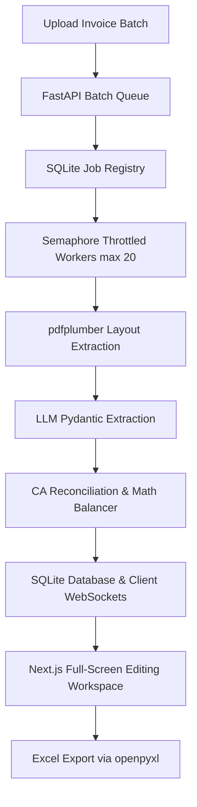

# AuditOS: Enterprise CA-Level Invoice Auditor

AuditOS is an enterprise-grade, high-accuracy AI pipeline designed to extract, mathematically reconcile, and audit complex tax invoices (Sales & Purchase) with the rigor and precision of a Chartered Accountant (CA) or Big-4 audit firm.

---

## 🚀 Key Features

- **Layout-Aware Parsing (`pdfplumber`):** Uses layout-aware text coordinates mapping (`layout=True`) to maintain the physical spatial positioning of columns, lines, and complex tables. This avoids the text-scrambling limitations of sequential extraction libraries and gives the LLM perfect visual structure awareness.
- **Granular Line-Item Extraction:** Seamlessly parses unstructured and multi-page PDF tables, ignoring non-data headers and capturing individual billing transactions with 100% itemization.
- **Math Balancing & Guardrails:** Dynamically checks and corrects LLM hallucinations:
  - **Gross vs. Net Validation:** Automatically resolves situations where Gross values are mistakenly parsed as Net values by subtracting discounts to balance ledgers.
  - **Anti-Double Counting:** Detects and filters out "Sub-Total" or "Total" rows erroneously parsed as line items.
  - **Statutory Math Apportionment:** Re-allocates aggregate tax amounts (IGST, CGST, SGST) down to line items proportionally based on taxable values.
- **Unallocated Variance Injection:** Instantly flags discrepancies between itemized sum and the final invoice total, automatically injecting an `Unallocated / Missing Lines` row to balance the ledger down to the penny.
- **Side-by-Side Verification Interface:** Next.js frontend with dual-pane layout showing the source invoice PDF alongside an interactive editing grid.
- **Full-Screen Workspace Mode:** A dedicated high-productivity mode rendering 20+ GST fields simultaneously across a full-viewport, layout-optimized grid to allow audit team reviews.
- **Asynchronous Batch Processing:** A zero-infra queueing backend powered by SQLite, background task threading, client-side WebSocket progress notifications, and Semaphore throttling to prevent LLM rate limiting.
- **Enterprise Security & Auth:** Secure role-based access control (RBAC), JWT authentication with password hashing, and protected routes via Next.js `AuthGuard`.

---

## 🛠️ Tech Stack & Architecture

- **Backend:** FastAPI, Python 3.10+, SQLAlchemy (SQLite engine).
- **Frontend:** TypeScript, React, Next.js, TailwindCSS.
- **Extraction Engine:** `pdfplumber` (layout preservation) combined with `Pydantic` and `LiteLLM` routing.
- **Report Generation:** Pandas & OpenPyXL for exporting Excel ledgers.

### System Architecture Flowchart


---

## 💻 Getting Started

### 1. Backend Setup
1. Navigate to the backend directory and set up a virtual environment:
   ```bash
   cd backend
   python -m venv venv
   source venv/bin/activate  # On Windows: venv\Scripts\activate
   ```
2. Install dependencies:
   ```bash
   pip install -r requirements.txt
   ```
3. Configure your environment variable in a `.env` file:
   ```env
   OPENROUTER_API_KEY="your-openrouter-api-key"
   API_BASE_URL="http://localhost:8080"
   ```
4. Start the backend dev server:
   ```bash
   uvicorn main:app --reload --port 8000
   ```

### 2. Frontend Setup
1. Navigate to the frontend directory:
   ```bash
   cd frontend
   ```
2. Install npm packages:
   ```bash
   npm install
   ```
3. Configure environment variables in `.env.local`:
   ```env
   NEXT_PUBLIC_API_URL="http://localhost:8000"
   ```
4. Start the frontend dev server:
   ```bash
   npm run dev
   ```

---

## 📅 Scalability & Reliability Roadmap
For large-scale corporate deployments (processing 10,000+ invoices daily), AuditOS is structured to migrate to cloud-native queueing:
- **Distributed Queues:** Transitioning SQLite/FastAPI background tasks to AWS SQS / RabbitMQ with Celery workers.
- **Object Storage:** Moving file storage to Google Cloud Storage (GCS) or AWS S3.
- **Enterprise Database:** Scaling the relational layer to PostgreSQL or Amazon RDS.
