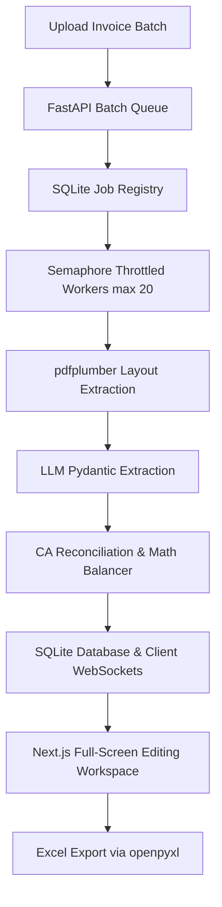

# AuditOS

**Enterprise CA-Level Invoice Auditor & Financial Reconciliation Platform**

AuditOS is a highly specialized, enterprise-grade AI pipeline designed to automate the extraction, mathematical reconciliation, and auditing of complex tax invoices (Sales & Purchase). Engineered to meet the rigorous standards of Chartered Accountants (CAs) and Big-4 audit firms, AuditOS bridges the gap between unstructured documents and strictly typed financial ledgers.

---

## 🚀 Core Capabilities

- **Layout-Preserving Extraction Engine:** Built on top of `pdfplumber` with coordinate-aware parsing (`layout=True`), ensuring perfect spatial awareness. This mitigates the text-scrambling limitations typical of sequential OCR/extraction libraries, providing the LLM with an accurate visual representation of complex, multi-page tables.
- **Granular Transaction Itemization:** Intelligently parses unstructured PDF tables, gracefully ignoring non-data headers, footers, and page breaks to capture individual billing transactions with 100% itemization accuracy.
- **Deterministic Math Reconciliation & Guardrails:** Dynamically validates and corrects LLM hallucinations against rigid accounting rules:
  - **Gross vs. Net Validation:** Automatically resolves parsing anomalies where Gross values are misidentified as Net values by computing discount differentials to balance ledgers.
  - **Anti-Double Counting:** Programmatically detects and filters out aggregate rows (e.g., "Sub-Total", "Grand Total") erroneously extracted as transaction line items.
  - **Statutory Tax Apportionment:** Re-allocates aggregate tax amounts (IGST, CGST, SGST) down to the line-item level, distributed proportionally based on taxable values.
- **Automated Ledger Balancing:** Instantly flags discrepancies between the sum of itemized lines and the final invoice total, automatically injecting an `Unallocated / Missing Lines` variance row to balance the ledger down to the penny.
- **Advanced Financial Reconciliation Engine (Phases 3C & 4A):** A deterministic, 8-stage post-processing logic that executes after candidate extraction:
  - **Stage 1 (Semantic Classification):** Maps unstructured table headers (e.g. Rate, Amount) to correct ledger fields.
  - **Stage 2 (Evidence Candidate Scoring):** Computes evidence logs detailing score contributions and penalties for each extraction candidate.
  - **Stage 3 (HSN Guardrails):** Prevents HSN/SAC codes from being misidentified as taxable values.
  - **Stage 4 (Tax Mathematics Engine):** Runs multiple mathematical paths to find the lowest-variance calculation.
  - **Stage 5 (Dual-State Reconciler):** Dynamically detects gross-based vs. net-based billing models.
  - **Stage 6 (Variance Classifier):** Identifies error reasons (e.g. `ROUND_OFF`, `COLUMN_SHIFT`, `GLOBAL_DISCOUNT`).
  - **Stage 7 (Auto-Correction Proposals):** Creates structured corrections that are patched in-flight.
  - **Stage 8 (Layout Memory):** Hashes page coordinates and header positions to cache layout structures.
- **CA Audit Review Dashboard:** Integrates an interactive drawer UI allowing human auditors to review reconciliation variances and accept auto-correction proposals with one click.
- **High-Productivity Audit Workspace:** A dedicated, full-screen Next.js interface featuring a dual-pane layout. It renders the source invoice PDF alongside an interactive, layout-optimized grid displaying 20+ GST fields simultaneously for rapid CA review.
- **Asynchronous & Scalable Batch Processing:** Features a zero-infra queueing backend powered by SQLite and threading, complete with client-side WebSocket progress notifications and Semaphore throttling to prevent LLM API rate limits.
- **Enterprise-Grade Security:** Implements secure Role-Based Access Control (RBAC), JWT-based authentication with bcrypt password hashing, and strictly protected Next.js routes via an `AuthGuard` middleware layer.

---

## 🛠️ Technology Stack & Architecture

- **Backend Architecture:** FastAPI (Python 3.10+), SQLAlchemy ORM (SQLite engine), Pydantic for strict schema validation, and LiteLLM for LLM routing.
- **Frontend Architecture:** React 18, Next.js (App Router), TypeScript, and TailwindCSS, utilizing a custom glassmorphic design system.
- **Data Processing:** `pdfplumber` for spatial PDF extraction, alongside Pandas and OpenPyXL for robust Excel ledger generation.

### System Architecture Flowchart



---

## 💻 Local Development Setup

### 1. Backend Service
The backend service handles PDF processing, LLM orchestration, and WebSocket communication.

```bash
cd backend
python -m venv venv

# Activate the virtual environment
# Windows: venv\Scripts\activate
# Unix/macOS: source venv/bin/activate

pip install -r requirements.txt
```

Create a `.env` file in the `backend` directory:
```env
OPENROUTER_API_KEY="your-openrouter-api-key"
API_BASE_URL="http://localhost:8000"
```

Start the FastAPI development server:
```bash
uvicorn main:app --reload --port 8000
```

### 2. Frontend Application
The frontend application is a modern Next.js dashboard for invoice review and user authentication.

```bash
cd frontend
npm install
```

Create a `.env.local` file in the `frontend` directory:
```env
NEXT_PUBLIC_API_URL="http://localhost:8000"
```

Start the Next.js development server:
```bash
npm run dev
```

The application will be accessible at `http://localhost:3000`.

---

## 📅 Scalability & Reliability Roadmap

AuditOS is architected for seamless migration to cloud-native infrastructure for enterprise deployments (10,000+ invoices/day):

- **Distributed Queuing:** Migration from SQLite/FastAPI background tasks to AWS SQS or RabbitMQ orchestrated by Celery workers.
- **Persistent Object Storage:** Transitioning ephemeral file storage to Google Cloud Storage (GCS) or AWS S3.
- **Enterprise Relational Layer:** Upgrading the local SQLite database to a highly available PostgreSQL cluster or Amazon RDS.
