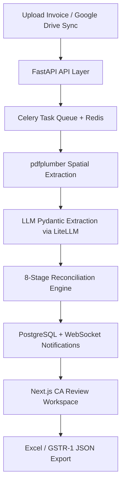

# AuditOS

**Enterprise CA-Level Invoice Auditor & Financial Reconciliation Platform**

AuditOS is a highly specialized, enterprise-grade AI pipeline designed to automate the extraction, mathematical reconciliation, and auditing of complex tax invoices (Sales & Purchase). Engineered to meet the rigorous standards of Chartered Accountants (CAs) and Big-4 audit firms, AuditOS bridges the gap between unstructured documents and strictly typed financial ledgers.

---

## Core Capabilities

### Extraction & Reconciliation
- **Layout-Preserving Extraction Engine:** Built on `pdfplumber` with coordinate-aware parsing (`layout=True`), providing the LLM with an accurate spatial representation of complex multi-page tables and mitigating text-scrambling from sequential OCR.
- **Granular Transaction Itemization:** Parses unstructured PDF tables while ignoring non-data headers, footers, and page breaks to capture individual billing transactions accurately.
- **Deterministic Math Reconciliation & Guardrails:** Validates and corrects LLM outputs against rigid accounting rules:
  - **Gross vs. Net Validation:** Resolves parsing anomalies where gross values are misidentified as net values by computing discount differentials.
  - **Anti-Double Counting:** Detects and filters out aggregate rows (Sub-Total, Grand Total) extracted as line items.
  - **Statutory Tax Apportionment:** Re-allocates aggregate tax amounts (IGST, CGST, SGST) to line-item level proportionally by taxable value.
- **Automated Ledger Balancing:** Flags discrepancies between itemized line sums and invoice totals, injecting an `Unallocated / Missing Lines` variance row to balance to the penny.
- **8-Stage Reconciliation Engine:** Post-extraction pipeline covering semantic classification, evidence scoring, HSN guardrails, tax math, dual-state reconciliation, variance classification, auto-correction proposals, and layout memory caching.

### GST Compliance
- **GSTR-2B Reconciliation:** Deterministic 8-stage engine matching purchase invoices against the GSTR-2B portal data, with ITC Section 17(5) eligibility rules and Excel export.
- **GSTR-1 JSON Export:** Generates GSTR-1 JSON in GST portal schema format (B2B, B2CS, HSN summary, document summary) from processed sales invoices.
- **43B(h) MSME Compliance:** Tracks vendor payment timelines against Section 43B(h) limits and flags at-risk outstanding balances.
- **Duplicate Invoice Detection:** Cross-batch deduplication using composite key hashing (GSTIN + invoice number + date + amount) to prevent double-booking.

### Google Drive Auto-Sync
- **One-click pull:** Configure a Drive folder once (folder URL or ID), then trigger a sync from the UI — no CLI needed.
- Per-tenant config persisted in the database (`GoogleDriveSyncConfig`); subsequent triggers reuse the saved folder without re-entering it.
- Sync jobs run via Celery, downloading PDFs, deduplicating by MD5, extracting via the standard pipeline, and writing to Excel.
- Deterministic `batch_id` (`sync_{tenant}_{YYYYMMDD}`) links each sync run to the existing Excel export endpoint — download with one click from the history table.
- Celery Beat schedules (monthly by default) stored in `backend/data/beat_schedules.json` and registered on worker startup; never committed (excluded by `.gitignore`).
- Supports real-time webhook-based sync for instant processing.

### Multi-Tenant & Auth
- Full multi-tenant data isolation — each firm's data is scoped to their tenant, enforced at the API layer.
- JWT-based authentication with bcrypt, role-based access control (RBAC), and `require_same_tenant` middleware.
- User session persistence and per-user preferences stored server-side.

### CA Audit Workspace
- **Review Panel:** Interactive drawer UI for auditors to inspect reconciliation variances and accept auto-correction proposals with one click.
- **Dual-Pane Interface:** Full-screen Next.js layout rendering source PDF alongside an editable grid of 20+ GST fields simultaneously.
- **Task Annotations:** Auditors can annotate individual invoice tasks with notes and flags, stored per-user.

### Observability
- Sentry integration with FastAPI, SQLAlchemy, and Celery integrations wired in — controlled via `SENTRY_DSN` env var.
- Structured JSON logging for ops dashboards (Datadog, CloudWatch, Render logs).
- Observability log table for per-request audit trails.

---

## Technology Stack

| Layer | Technology |
|---|---|
| Backend | FastAPI (Python 3.10+), SQLAlchemy ORM, Pydantic, LiteLLM |
| Async Tasks | Celery + Redis |
| Frontend | Next.js (App Router), React 18, TypeScript, TailwindCSS |
| PDF Processing | pdfplumber (coordinate-aware spatial extraction) |
| Storage | PostgreSQL (prod) / SQLite (dev), GCS / local filesystem |
| Auth | JWT + bcrypt, multi-tenant RBAC |
| Observability | Sentry, structured JSON logging |

### System Architecture



---

## Local Development Setup

### Prerequisites
- Python 3.10+
- Node.js 18+
- Redis (for Celery task queue)

### 1. Backend

```bash
cd backend
python -m venv venv

# Windows
venv\Scripts\activate
# Unix/macOS
source venv/bin/activate

pip install -r requirements.txt
```

Copy the example env file and fill in your values:

```bash
cp .env.example .env
```

Key variables in `.env`:

```env
# LLM routing (at least one required)
OPENROUTER_API_KEY="your-openrouter-api-key"

# Database (defaults to SQLite for local dev)
DATABASE_URL="sqlite:///./audit_os.db"

# Celery
CELERY_BROKER_URL="redis://localhost:6379/0"

# Google Drive sync (optional)
GOOGLE_DRIVE_SERVICE_ACCOUNT_JSON=/path/to/service-account-key.json
GOOGLE_DRIVE_FOLDER_ID=YOUR_GOOGLE_DRIVE_FOLDER_ID_HERE

# Observability (optional)
SENTRY_DSN=""
```

Start the API server and Celery worker:

```bash
# Terminal 1 — API
uvicorn main:app --reload --port 8000

# Terminal 2 — Celery worker
celery -A celery_app worker --loglevel=info
```

### 2. Frontend

```bash
cd frontend
npm install
```

Create `frontend/.env.local`:

```env
NEXT_PUBLIC_API_URL="http://localhost:8000"
```

```bash
npm run dev
```

The app will be at `http://localhost:3000`.

### Quick Start Scripts
- **Windows:** `START_ALL_WINDOWS.bat`
- **Linux/macOS:** `START_ALL_LINUX.sh`

---

## Project Structure

```
backend/
  core/extraction/        # 9-stage extraction pipeline
  services/
    auth.py               # JWT, RBAC, multi-tenant middleware
    gstr1_generator.py    # GSTR-1 JSON export
    gstr2b_reconciler.py  # GSTR-2B reconciliation engine
    duplicate_detector.py # Cross-batch deduplication
    google_drive_sync.py  # Google Drive polling & webhook sync
    excel_sync.py         # Excel output with lockfile coordination
    vendor_profile.py     # Per-vendor extraction hints
  tests/regression/       # GST math, GSTR-2B, ITC rules regression suite
  scripts/                # Setup, backtest, and training utilities

frontend/src/
  app/
    invoice-extractor/    # Batch upload & extraction workspace
    reconciliation/       # GSTR-2B reconciliation UI
    firm-settings/        # Tenant & user settings
    google-drive-sync/    # Drive sync configuration & status
  components/
    ReviewPanel.tsx        # CA audit review drawer
    AuthGuard.tsx          # Route-level auth + role enforcement
    Sidebar.tsx            # Navigation
```

---

## Security Notes

- Never commit `.env` files, service account JSON keys, or vendor profile data.
- `backend/data/` and `data/` directories are in `.gitignore` — they contain client-specific data.
- Use `.env.example` as the only committed env reference; replace all placeholder values before running.
- Vendor profiles (per-client GSTIN extraction hints) are stored locally in `backend/data/vendor_profiles/` and must not be committed.
- See [`SECURITY_REMEDIATION_PHASE1.md`](SECURITY_REMEDIATION_PHASE1.md) for the current state of the security audit: Critical findings fixed to date, remaining High/Medium/Low findings deferred to later phases, and the authorization model (`require_same_tenant`, `RoleChecker`) each protected endpoint follows.
